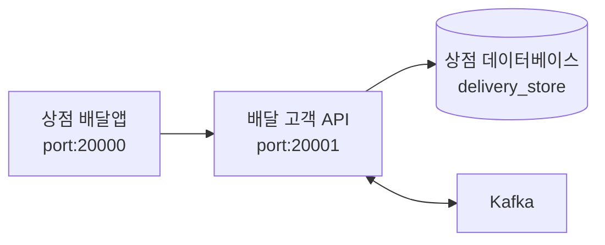

# '상점용 API' 프로젝트
- 배달 상점에서 사용하는 API 서비스
- Role: **`delivery-store-api`**
- Port: **`20001`**

# Tech Stack
- Spring Boot 3
- Spring Data JPA
- Spring Security
- JWT
- Apache Kafka
- MySQL

# 시스템 구성과 흐름

# 초기 접속 URL
- http://localhost:20001/hello

# 초기 계정
- ID: test@test.com
- PW: 1111